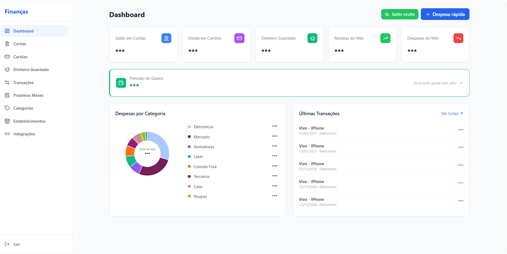
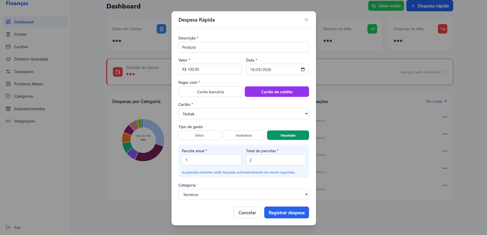
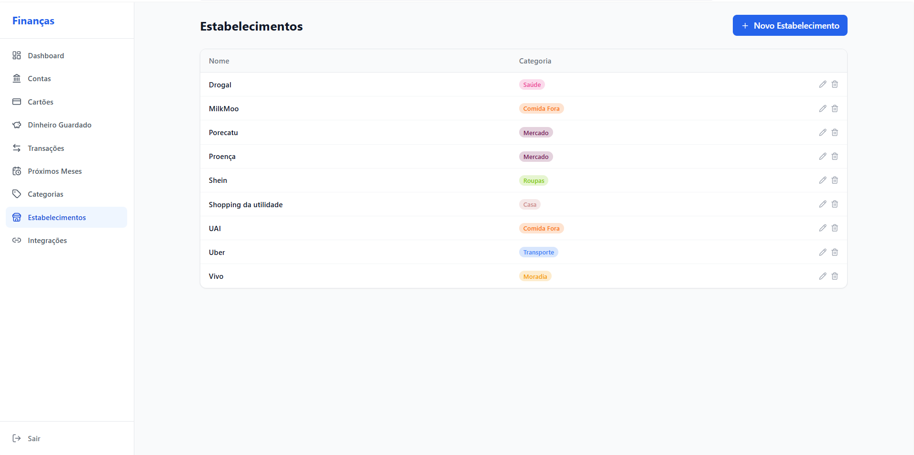

# Finance App

Aplicação fullstack de gestão financeira pessoal, com integração a bancos via Open Finance.

## O que é

Sistema para acompanhar e organizar suas finanças pessoais: contas bancárias, cartões de crédito, transações, poupanças e gastos recorrentes — tudo em um único lugar. 
## Telas





## Funcionalidades

- **Dashboard** — visão geral do saldo, gastos e capacidade de gasto
- **Contas bancárias** — gerenciamento de múltiplas contas
- **Cartões de crédito** — controle de faturas e limite
- **Transações** — histórico completo com categorias e estabelecimentos
- **Poupanças** — acompanhamento de reservas financeiras
- **Recorrências** — previsão de gastos futuros
- **Categorias e estabelecimentos** — organização e análise de gastos

## Stack

**Backend**
- Java 21 + Spring Boot 3.4.4
- Spring Security com Google OAuth2 (JWT)
- Spring Data JPA + H2 (dev) / PostgreSQL (prod)

**Frontend**
- React 18 + Vite


### Frontend

```bash
cd front
npm install
npm run dev
```

## Autenticação

O sistema usa **Google OAuth2**. O frontend envia o Google ID Token no header `Authorization: Bearer <token>`, que é validado pelo backend. Para configurar:

1. Crie credenciais OAuth2 no Google Cloud Console (tipo: Aplicativo Web)
2. Defina `GOOGLE_CLIENT_ID` e `app.security.enabled=true` no backend
3. Configure `VITE_SECURITY_ENABLED=true` no frontend
